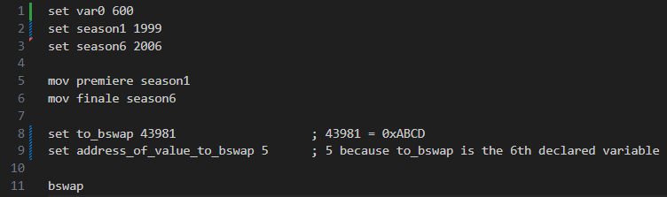
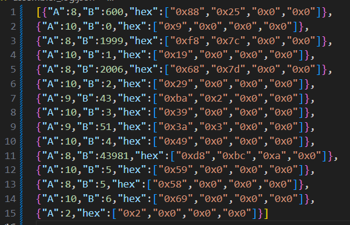

# Учебная виртуальная машина (УВМ)

Этот проект реализует ассемблер и интерпретатор для учебной виртуальной машины (УВМ), поддерживающей базовый набор команд. Ассемблер преобразует читаемый формат команд в бинарный файл, а интерпретатор выполняет команды из бинарного файла и создает дамп памяти в формате JSON.

## Описание команд УВМ

### Загрузка константы
| Поле | Биты        | Описание      |
|------|-------------|---------------|
| A    | Биты 0–3    | Код команды (8) |
| B    | Биты 4–30   | Константа     |

**Размер команды:** 4 байта  
**Операнд:** Поле B  
**Результат:** Регистр-аккумулятор  

**Тест** (A=8, B=600):
```
0x88, 0x25, 0x00, 0x00
```

### Чтение значения из памяти
| Поле | Биты        | Описание               |
|------|-------------|------------------------|
| A    | Биты 0–3    | Код команды (10)       |
| B    | Биты 4–10   | Смещение               |

**Размер команды:** 4 байта  
**Операнд:** Значение в памяти по адресу, который является суммой адреса (регистр-аккумулятор) и смещения (поле B)  
**Результат:** Регистр-аккумулятор  

**Тест** (A=10, B=18):
```
0x2A, 0x01, 0x00, 0x00
```

### Запись значения в память
| Поле | Биты        | Описание                |
|------|-------------|-------------------------|
| A    | Биты 0–3    | Код команды (9)         |
| B    | Биты 4–14   | Адрес                   |

**Размер команды:** 4 байта  
**Операнд:** Регистр-аккумулятор  
**Результат:** Значение в памяти по адресу, который является полем B  

**Тест** (A=9, B=85):
```
0x59, 0x05, 0x00, 0x00
```

### Унарная операция: bswap()
| Поле | Биты        | Описание              |
|------|-------------|-----------------------|
| A    | Биты 0–3    | Код команды (2)       |

**Размер команды:** 4 байта  
**Операнд:** Значение в памяти по адресу, который является регистром-аккумулятором  
**Результат:** Регистр-аккумулятор  

**Тест** (A=2):
```
0x02, 0x00, 0x00, 0x00
```

## Запуск проекта

1. **Ассемблер**  
Ассемблер принимает на вход файл с текстом исходной программы (задан из командной строки), генерирует бинарный файл с командами УВМ и сохраняет журнал команд в формате JSON.

2. **Интерпретатор**  
Интерпретатор принимает на вход бинарный файл и выполняет команды, сохраняя значения памяти в JSON формате.

## Формат файлов

- **Файл-лог ассемблера**: JSON файл, содержащий ассемблированные инструкции в формате "ключ=значение".
- **Файл-результат интерпретатора**: JSON файл с дампом значений из диапазона памяти УВМ.

## Тестирование

Для каждой команды предусмотрены тесты, которые проверяют корректность выполнения команд УВМ.

Исходная программа



Логи ассемблера



Результат (Дамп памяти)

